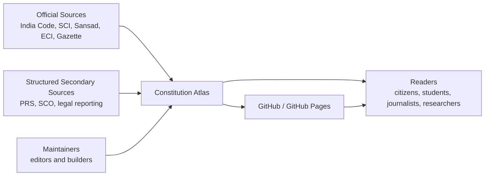
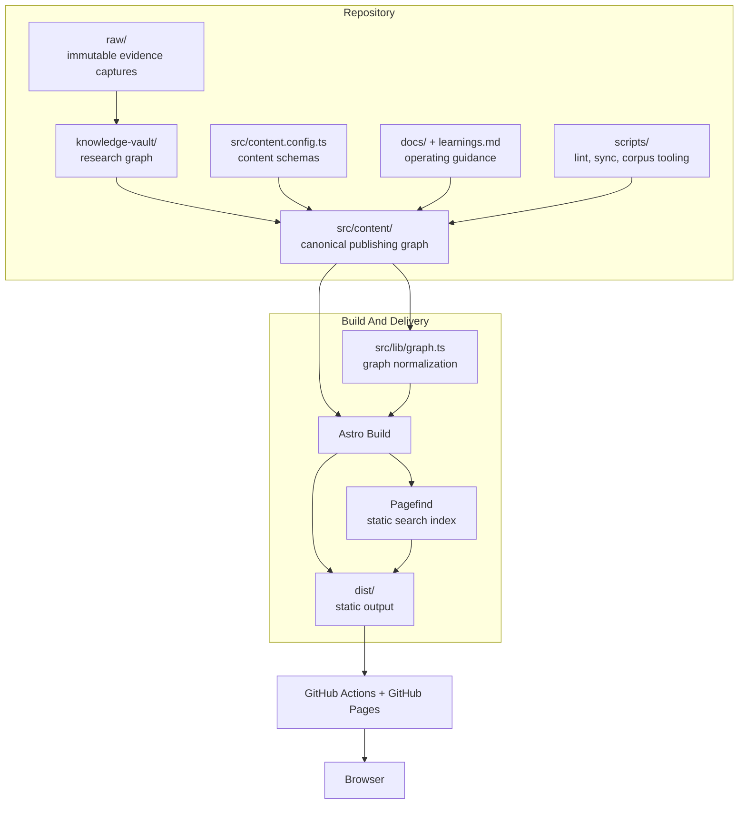
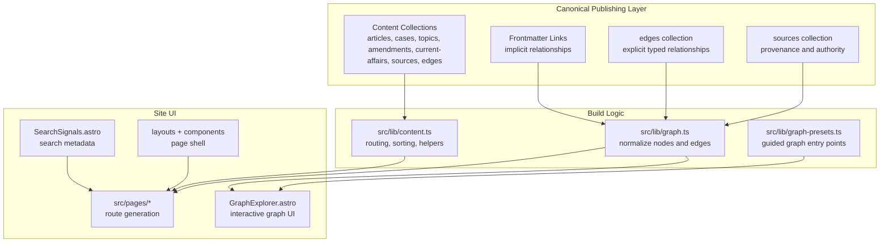
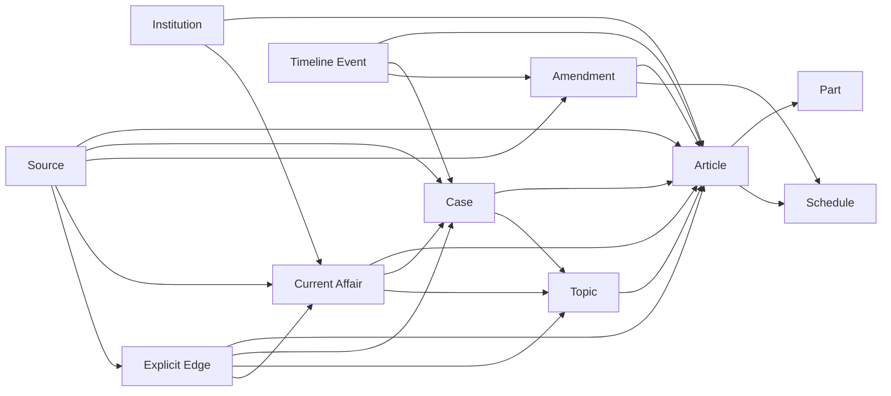
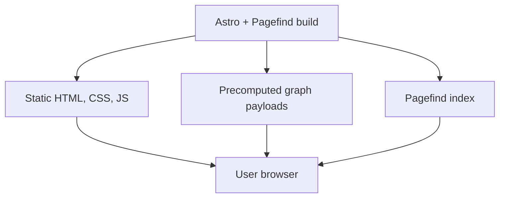

# Architecture Diagrams

This is a C4-style diagram set for Constitution Atlas.

It is intentionally adapted to a static content system rather than a conventional application backend. The goal is to make the system legible at four levels:

1. system context
2. containers
3. components
4. key workflows and graph/data structure

Use this alongside [architecture.md](./architecture.md), which explains the same system in prose.

## C4-1: System Context

This level shows the project in relation to its users, upstream sources, and deployment platform.



### Interpretation

- Readers consume the published constitutional reference system.
- Maintainers ingest, normalize, and publish content.
- Official sources are the primary truth layer.
- Secondary sources are supporting context, not constitutional authority.
- GitHub Pages is the delivery channel, not the knowledge source.

## C4-2: Container Diagram

This level shows the major runtime and repository containers.



### Interpretation

- `raw/`, `knowledge-vault/`, and `src/content/` are separate containers with different trust levels.
- `src/content/` is the only content container that directly feeds the public site.
- `src/lib/graph.ts` is a build-time container, not a standalone service.
- The deployed product is a static site plus static search assets.

## C4-3: Component Diagram

This level breaks the canonical publishing and graph layer into components.



### Interpretation

- Most relationships still originate in content frontmatter.
- The `edges` collection is where doctrinal and high-value graph semantics become first-class.
- The graph explorer consumes a normalized graph, not raw Markdown entries.
- Search metadata is emitted by page components at build time.

## C4-4: Knowledge Graph / Data Model

This level focuses on the publishable graph itself.



### Interpretation

- `Source` is not just bibliography; it is part of the trust architecture.
- `Edge` is a canonical record for typed relationships that should not be inferred loosely.
- Current-affairs desks are connected back into constitutional doctrine rather than floating as a news feed.

## C4-5: Editorial Workflow Diagram

This is not formal C4, but it is architecturally necessary for this project because editorial discipline is part of the system design.

```mermaid
flowchart LR
    Detect[Detect development<br/>judgment, bill, dispute, notification]
    Verify[Verify constitutional hook<br/>and source quality]
    Capture[Capture in raw/]
    Synthesize[Write or update research note<br/>in knowledge-vault/]
    Normalize[Normalize into src/content/]
    Link[Add constitutional anchors,<br/>sources, and graph links]
    Lint[Run content and vault lint]
    Build[Build static site]
    Publish[Publish to GitHub Pages]
    Review[Review on daily / weekly / monthly cadence]

    Detect --> Verify
    Verify --> Capture
    Capture --> Synthesize
    Synthesize --> Normalize
    Normalize --> Link
    Link --> Lint
    Lint --> Build
    Build --> Publish
    Publish --> Review
    Review --> Detect
```



### Interpretation

- Publication is downstream of review and normalization.
- The loop is continuous; the site is a maintained reference desk, not a one-time content dump.
- Graph quality depends on this workflow because the graph is built from canonical content.

## C4-6: Deployment And Runtime Diagram

This level clarifies what exists at runtime.



### Interpretation

- There is no production application server for readers.
- There is no production graph database in the current architecture.
- Search and graph interactivity are client-side over build-time assets.

## Short Summary

If you want the shortest architectural reading:

```text
Constitution Atlas = source-backed constitutional corpus
                    + research graph
                    + canonical publishing graph
                    + build-time relationship engine
                    + static delivery pipeline
```

That is the current C4-style view of the system.
