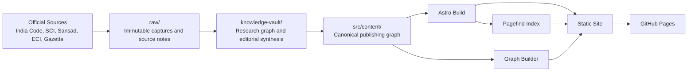
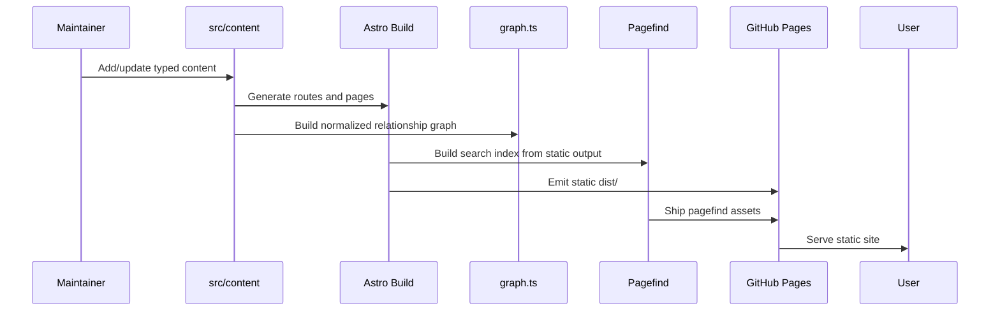

# Architecture

Constitution Atlas is a static-first constitutional intelligence system with three distinct knowledge layers:

1. `raw/` for immutable evidence
2. `knowledge-vault/` for research and synthesis
3. `src/content/` for canonical publishable truth

The site is built from the canonical layer, not directly from research notes or source captures.

Companion diagram set:
- [architecture-c4.md](./architecture-c4.md)

## System View



## Direction Of Truth

```text
official source -> raw capture -> research note -> canonical content -> site page
```

This is the central architectural rule of the repo. It prevents draft notes or raw source fragments from becoming public truth without review.

## Layer Responsibilities

### 1. Evidence Layer

Location:
- `raw/`

Purpose:
- preserve source provenance
- store captured evidence, notes, extracts, and reference files
- separate evidence from interpretation

Rules:
- do not publish directly from this layer
- preserve upstream URLs, dates, and source tier when possible

### 2. Research Layer

Location:
- `knowledge-vault/`

Purpose:
- maintain an Obsidian-compatible semantic graph for human research
- support backlinks, discovery, doctrine mapping, source synthesis, and editorial planning

Rules:
- useful for thinking, not canonical publication
- may contain incomplete or exploratory notes
- should feed durable syntheses back into `src/content/`

### 3. Canonical Publishing Layer

Location:
- `src/content/`
- schema in `src/content.config.ts`

Purpose:
- define the publishable constitutional graph
- store typed entities and relationships
- support build-time validation and stable routing

Rules:
- this is the source of truth for the public site
- all serious legal/doctrinal/current-affairs writing should anchor to constitutional text or official institutional sources

## Canonical Content Model

The public graph is built from typed collections in `src/content.config.ts`.

Primary content nodes:
- `articles`
- `parts`
- `schedules`
- `cases`
- `topics`
- `institutions`
- `glossary`
- `amendments`
- `timeline`
- `current-affairs`
- `sources`
- `edges`

Interpretation:
- content collections define the domain entities
- the `edges` collection defines explicit typed relationships
- frontmatter links define additional implicit relationships

## Repository View

```mermaid
flowchart TD
    A[src/content/] --> A1[Articles]
    A --> A2[Cases]
    A --> A3[Topics]
    A --> A4[Current Affairs]
    A --> A5[Amendments]
    A --> A6[Parts / Schedules]
    A --> A7[Sources / Timeline / Institutions / Glossary]
    A --> A8[Edges]

    B[src/lib/] --> B1[content.ts<br/>routing, sorting, helpers]
    B --> B2[graph.ts<br/>graph normalization and explorer data]
    B --> B3[graph-presets.ts<br/>guided graph presets]

    C[src/components/] --> C1[GraphExplorer.astro]
    C --> C2[PageIntro.astro]
    C --> C3[SearchSignals.astro]

    D[src/pages/] --> D1[reference pages]
    D --> D2[current-affairs pages]
    D --> D3[graph pages]
    D --> D4[search page]

    E[docs/] --> E1[knowledge-system.md]
    E --> E2[source-research.md]
    E --> E3[editorial-operations.md]
    E --> E4[architecture.md]

    F[knowledge-vault/] --> F1[entity notes]
    F --> F2[issue notes]
    F --> F3[source notes]

    G[raw/] --> G1[source captures]
```



## Build And Delivery Architecture



## Runtime Architecture

There is no traditional application backend.

The runtime model is:
- prebuilt static pages
- precomputed graph payloads
- client-side interactive graph rendering
- client-side search against a static Pagefind index

Benefits:
- cheap hosting
- strong cacheability
- simpler deployment
- easy review through version control
- no live production database required for reading

Tradeoff:
- editorial updates require rebuild/redeploy

For this product, that tradeoff is acceptable and preferable.

## Graph Architecture

The graph is a first-class product layer, not just a visual flourish.

Graph inputs:
- implicit relationships from canonical content frontmatter
- explicit typed edges from `src/content/edges/`
- source references for evidence display

Graph engine:
- `src/lib/graph.ts`
- `src/lib/graph-runtime.ts`

Graph outputs:
- normalized nodes
- normalized edges
- normalized directed edges
- edge families
- relation-level evidence
- graph intelligence metrics and communities
- explorer stats and legend
- profile-specific datasets such as `home`, `display`, and `full`

Graph UI:
- `src/components/GraphExplorer.astro`
- `src/pages/graph/index.astro`
- `src/pages/graph/backbone.astro`

Current graph design principles:
- use curated default scope instead of dumping the entire network
- show typed relationships, not generic related-content blobs
- expose evidence for edges
- keep pathfinding directional and evidence-backed
- use layout modes that match the question: organic, layered, and timeline
- separate backbone and expanded views by dataset, not by cosmetic filtering alone

## Search Architecture

Search is static and index-based.

Components:
- page metadata emitted by Astro pages
- Pagefind build during `npm run build`
- client-side search UI on `/search`

Why this architecture:
- no search server needed
- low hosting cost
- good fit for a large static corpus

## Editorial Operations Architecture

Editorial maintenance is part of the architecture, not an afterthought.

Operational docs:
- `docs/editorial-operations.md`
- `docs/source-research.md`
- `docs/knowledge-system.md`
- `learnings.md`

Guardrails:
- `npm run content:lint`
- `npm run vault:sync`
- `npm run vault:lint`

These tools ensure:
- relationships point to real slugs
- research-vault coverage stays aligned with canonical content
- large content expansions do not silently break the graph

## Deployment Architecture

Deployment target:
- GitHub Pages

Config:
- `astro.config.mjs`
- `.github/workflows/deploy.yml`

Behavior:
- Astro emits a fully static site
- base path is adjusted automatically for GitHub Pages project deployment
- pushes to `main` can publish through GitHub Actions

## Architectural Principles

The project currently follows these principles:

1. **Static-first**
   - prefer build-time computation over runtime services

2. **Source-backed**
   - legal/doctrinal claims should be traceable to constitutional text or official institutional records

3. **Typed canonical truth**
   - publishable content must live in schema-validated collections

4. **Research/publishing separation**
   - notes and exploratory syntheses are useful, but they are not automatically public truth

5. **Graph-first navigation**
   - relationships are part of the product, not just metadata

6. **Editorial maintainability**
   - the system should support ongoing current-affairs and doctrine maintenance without a rewrite

## Short Summary

Constitution Atlas is best understood as:

```text
static constitutional reference system
+ research graph
+ canonical publishing graph
+ typed relationship engine
+ current-affairs explainer layer
```

That is the architectural view the repo is currently optimized around.
